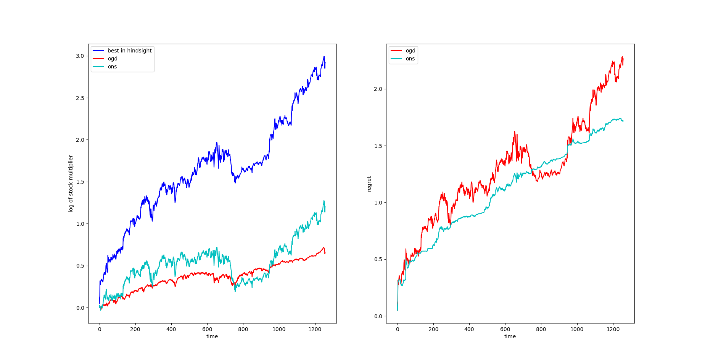

# Online Portfolio Selection

I've implemented Online Gradient Descent and Online Newton Step based on "Logarithmic Regret Algorithms for Online Convex Optimization".

Tested on S&P 500 dataset taken from https://www.kaggle.com/camnugent/sandp500?select=all_stocks_5yr.csv

## Results

### Stocks Visualization


### Return & Regret

Return is in log scale so while > 0 the algorithm makes money



## Notebook

The notebook file is just for convenience for the reader.

```py2ng.py``` converts ```.py``` to ```.ipynb```.
