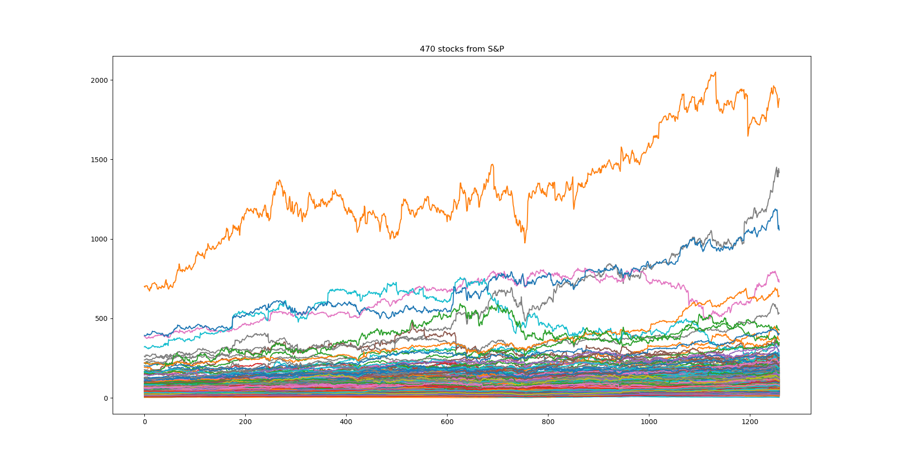
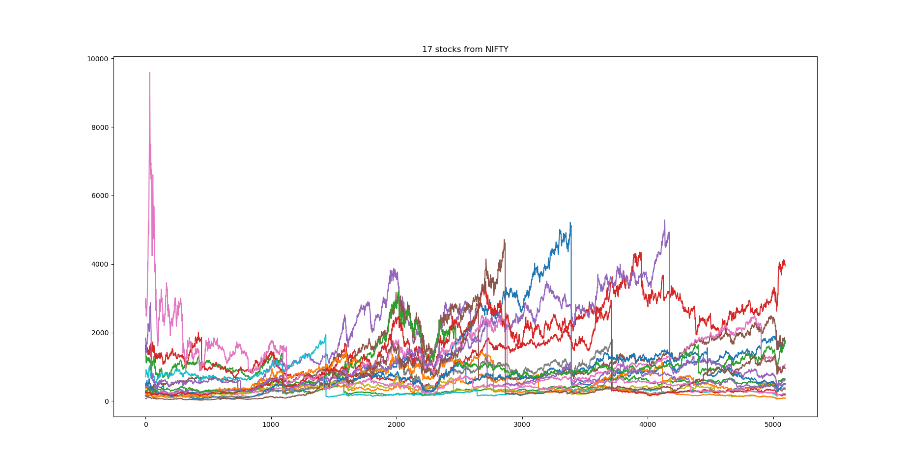
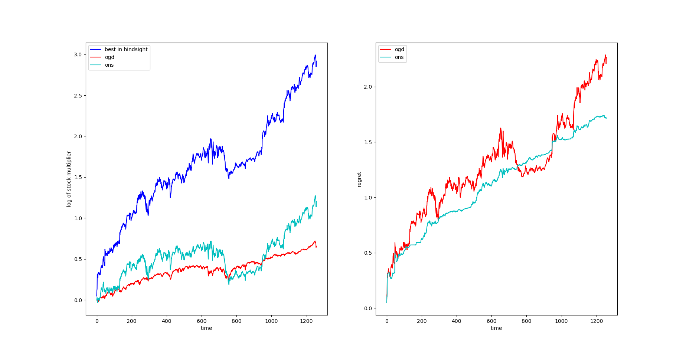
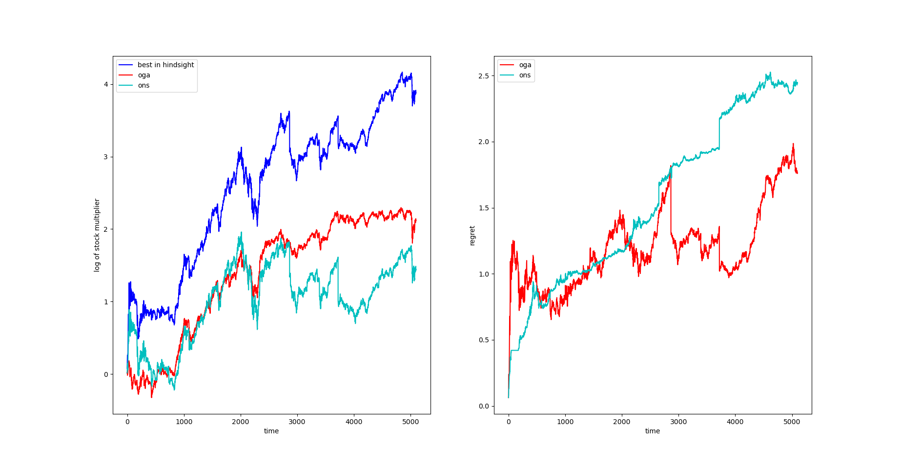

# Online Portfolio Selection

I've implemented Online Gradient Ascent and Online Newton Step based on "Logarithmic Regret Algorithms for Online Convex Optimization" (in ```/pdf```).

Tested on S&P 500 dataset:

https://www.kaggle.com/camnugent/sandp500?select=all_stocks_5yr.csv

And NIFTY 50 dataset:

 https://www.kaggle.com/rohanrao/nifty50-stock-market-data?select=BPCL.csv

## Results

### Stocks Visualization



### Return & Regret

Return is in log scale so while > 0: the algorithm makes money

#### S&P

#### NIFTY


## Notebook

The notebook file is just for convenience for the reader.

```py2ng.py``` converts ```.py``` to ```.ipynb```.
